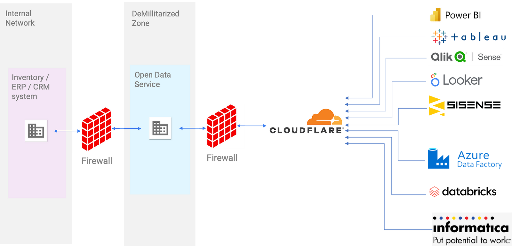

# OData-Bridge
This repository contains a sample C# project demonstrating the creation of an OData service using an SQLite database. It is part of a broader exploration on using OData for secure and scalable integration with cloud-based Business Intelligence (BI) and Extract, Transform, Load (ETL) systems.

## Project Description
This project demonstrates how you can implement a secure OData service that allows cloud-based BI and ETL systems to access your local ERP data. The repository is part of a larger conversation on securely integrating your systems with cloud-based BI and ETL systems, focusing on the utilization of a demilitarized zone (DMZ) to deploy your data service.

You can learn more about the overall reference architecture and strategy in the associated blog post: [Using OData for Secure and Scalable Integration with Cloud-Based BI and ETL Systems](https://medium.com/p/5be737c1b090).



## Prerequisites
Before you can run this project, you'll need to have the following installed:

- [.NET 7.0 SDK](https://dotnet.microsoft.com/download)
- [Visual Studio Code](https://code.visualstudio.com/download)
- [SQLite](https://sqlite.org/download.html)

## Installing Dependencies
This project relies on several NuGet packages. To install them, use the following commands in your terminal:

```bash
dotnet add package Microsoft.AspNetCore.OData
dotnet add package Microsoft.EntityFrameworkCore
dotnet add package Microsoft.EntityFrameworkCore.Sqlite
```

## Getting Started
To run this project, you will need to have .NET 5.0 SDK, Visual Studio Code, and SQLite installed on your machine. 

1. Clone the repository: `git clone https://github.com/Aleksey-Movchanyuk/odata-bridge.git`
2. Navigate into the directory: `cd odata-bridge`
3. Run the project: `dotnet run`

## Features
- Demonstrates how to create a simple OData service with SQLite
- Highlights how to secure and scale the service with cloud-based BI and ETL systems
- Provides insights into deploying the service in a DMZ

## Contributing
We welcome contributions to this project, whether in the form of issue reports, suggestions, or pull requests. Please read our [Contribution Guidelines](CONTRIBUTING.md) for more information.

## License
This project is licensed under the MIT License - see the [LICENSE](LICENSE.md) file for details.
